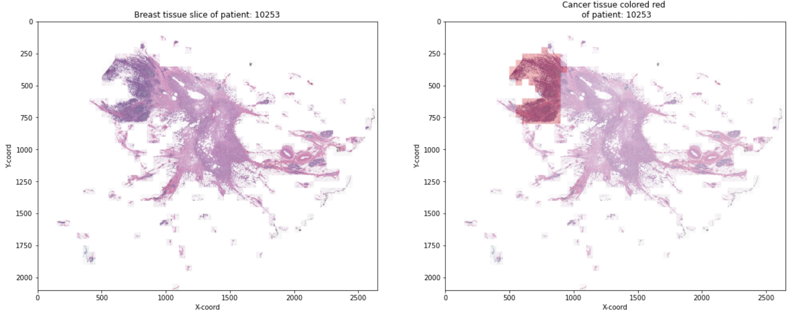

# Breast_Cancer_Detection

Invasive ductal carcinoma (IDC) is the most common form of breast cancer, with a 99% survival rate if detected early. The current detection method requires an expert pathologist to examine tissue slices. We automated the process by developing a 95% accurate CNN model for breast cancer classification and localization.

#### Result :
 

#### Dataset :  https://www.kaggle.com/datasets/paultimothymooney/breast-histopathology-images

|Dataset Description : The original dataset consisted of 162 whole mount slide images of Breast Cancer (BCa) specimens scanned at 40x. From that, 277,524 patches of size 50 x 50 were extracted (198,738 IDC negative and 78,786 IDC positive). Each patch’s file name is of the format: uxXyYclassC.png — > example 10253idx5x1351y1101class0.png . Where u is the patient ID (10253idx5), X is the x-coordinate of where this patch was cropped from, Y is the y-coordinate of where this patch was cropped from, and C indicates the class where 0 is non-IDC and 1 is IDC.

